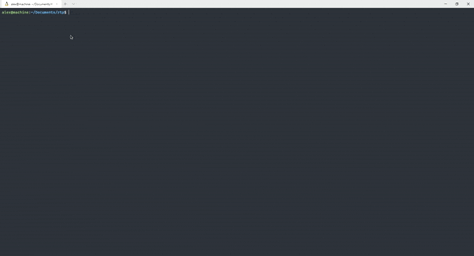

# RTP Course. Spring 2021.

**Streaming Twitter sentiment analysis system**

## Description

Application fetches streams from 2 endpoints and through __Router__ redirect them to _not_ dynamic analyzers that counts the score of each tweet and print it to screen

## Installation

1. Install dependencies with `$ mix deps.get`
1. Run application with `$ mix run`

## Demo

